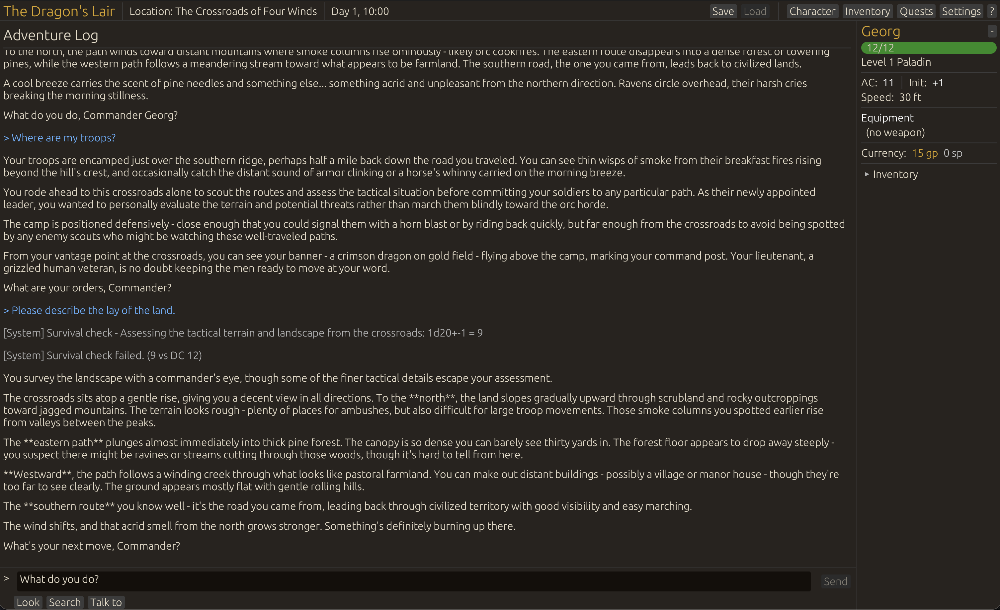

# chronicler

*An AI Dungeon Master that remembers.*

---

> *"I see you've found the Shadowfell Codex. Most visitors are drawn to the prettier volumes."*
>
> *A knowing smile crosses her weathered features. "That particular tome has been the subject of much... debate among our scholars."*
>
> — [The Wizard's Bargain](docs/transcripts/wizards_bargain.md)

---

A solo tabletop RPG powered by Claude. You play; the AI runs the world — narrating scenes, voicing NPCs, rolling dice, and tracking the consequences of your choices across sessions.

Compatible with D&D 5e. Runs locally. [Bring your own API key.](https://console.anthropic.com/)



## Quick Start

```bash
git clone https://github.com/SamuelSchlesinger/chronicler.git
cd chronicler
export ANTHROPIC_API_KEY=your_key_here
cargo run -p chronicler
```

## What Makes It Different

**The AI plays by the rules.** Skill checks, saving throws, combat, conditions, death saves — mechanically resolved, not handwaved.

**Your choices persist.** Spare the bandit? He might return. Offend the merchant? She remembers. The AI maintains a story memory that resurfaces naturally.

**It acts, not asks.** No "which enemy do you attack?" The DM reads the situation and moves the story forward.

## See It In Action

| | |
|---|---|
| [The Goblin Ambush](docs/transcripts/goblin_ambush.md) | A dwarf fighter springs a trap. Death saves ensue. |
| [The Wizard's Bargain](docs/transcripts/wizards_bargain.md) | An elf wizard seeks forbidden knowledge in ancient archives. |

## Under the Hood

```
chronicler         Bevy + egui desktop app
    |
chronicler-core    Game engine, rules, AI DM, persistence
    |
claude             Minimal Anthropic API client
```

The AI doesn't mutate game state directly. It calls tools — `skill_check`, `apply_damage`, `start_combat`, `remember_fact` — and a rules engine validates and applies the effects. The AI handles narrative; the engine ensures mechanical consistency.

[How the AI Dungeon Master Works](docs/HOW_IT_WORKS.md) — prompt design, tool system, story memory.

## Development

```bash
cargo build --workspace
cargo test --workspace
```

Requires Rust and an [Anthropic API key](https://console.anthropic.com/). Runs on macOS, Linux, and Windows.

## License

[CC BY-NC 4.0](LICENSE) — free for non-commercial use.

D&D mechanics from [SRD 5.2](https://dnd.wizards.com/resources/systems-reference-document) (CC BY 4.0, Wizards of the Coast).
